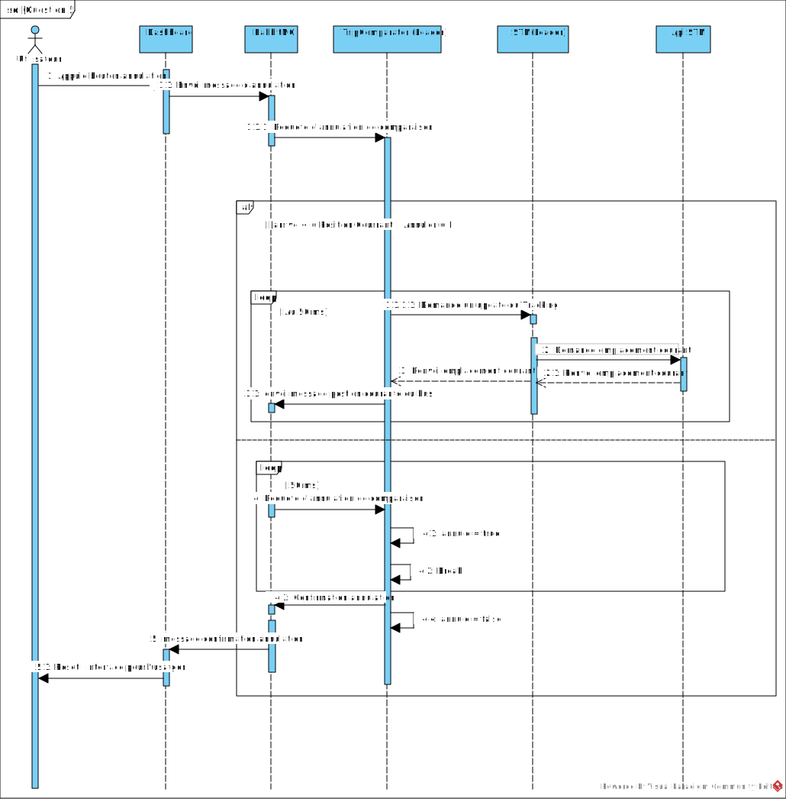

# Laboratoire #3

Groupe: 2 
Equipe: 04

Membres de l'équipe:
Jonathan Rodriguez Tames 
Ali Dickens Augustin
Jean-Philippe Lalonde


## Évaluation de la participation

>L'évaluation suivante est faite afin d'encourager des discussions au sein de l'équipe. Une discussion saine du travail de chacun est utile afin d'améliorer le climat de travail. Les membres de l'équipe ont le droit de retirer le nom d'un ou une collègue du rapport.

| nom de l'étudiant        | Facteur multiplicatif|
|:--------------------:    |:--------------------:|
| Jonathan Rodriguez Tames    |           1          |
| Ali Dickens Augustin        |			  1          |
| Jean-Philippe Lalonde		  |			  1          |

## Introduction

Dans le cadre de ce laboratoire, notre objectif est d'améliorer la résilience et la disponibilité de nos services face à des attaques intensifiées et variées. Pendant une période de 5 minutes, un outil similaire à Chaos Monkey simule des défaillances matérielles en détruisant des composants critiques à des fréquences élevées :

- Les services sont attaqués à une fréquence de **6 fois par minute**.
- Les volumes des composants de calcul (computational components) sont détruits à raison de **2 fois par minute**.
- Les composants de type connecteur subissent également des destructions à une fréquence de **2 fois par minute**.

En outre, les queues de messagerie utilisées pour la communication sont également ciblées, augmentant la complexité du maintien du service. Notre infrastructure doit donc être capable de se rétablir rapidement et de garantir la continuité du service de suivi des bus pour deux coordonnées spécifiques.

## Critères de réussite

Pour que notre expérience soit considérée comme un succès, nous devons répondre aux critères suivants :

- **Actualisation continue** : Les informations de suivi doivent s’actualiser en continu sans interruption, en indiquant correctement les bus associés aux coordonnées fournies.
- **Temps de réponse** : Le temps de réponse global (en millisecondes) doit rester inférieur à 500 ms, même lors des attaques.
- **Stabilité** : Le système doit se rétablir dans un délai inférieur à 500 ms après une destruction.
- **Précision des trajets** : Les informations sur la durée des trajets en voiture doivent rester correctes.
- **Réduction des erreurs** : Les erreurs, telles que les messages retardés ou répétés, doivent être minimisées.

## Plan du rapport

Ce rapport détaillera les approches et solutions mises en place pour répondre aux nouvelles exigences, tout en explorant les alternatives envisagées. Les sections suivantes seront abordées :

1. **Vues architecturales** pour décrire les stratégies de redondance et l’attribution des tâches entre les membres de l’équipe.
2. **Réponses aux questions spécifiques** liées aux concepts utilisés dans le projet, telles que :
   - La gestion des quorum queues et leur comportement face aux destructions.
   - L’utilisation de **Test Doubles** dans le cadre des tests, et leur rôle dans notre projet.
   - Les tactiques pour traiter les cas où les coordonnées fournies ne correspondent à aucun trajet d’autobus.
   - Une stratégie pour contrer les attaques visant les bases de données et assurer une résilience accrue.
   - Les modifications nécessaires pour implémenter une fonction d’annulation dans le système.

Avec ces ajustements, nous visons à démontrer la robustesse de notre système face à des attaques encore plus agressives, tout en explorant et justifiant les choix effectués parmi plusieurs approches possibles.

---
## Vues architecturales
- Au travers des différentes vues architecturales, montrez comment la redondance est présente dans vos microservices après l'implémentation du laboratoire 2. La présence des vues primaires et des catalogues d'éléments est nécessaire. Assurez-vous de bien présenter la tactique de redondance dans vos vues. Corrigez les problèmes des vues précédentes et montrez les changements apportés au laboratoire 3 pour résister aux nouvelles attaques, si applicables.

### Vues architecturales de type module - redondance


### Catalogue d'Élément - Vue Module

| **Nom de l'Élément**      | **Responsabilité**                                                   | **Commentaires/Lien avec autres services**                                                             |
|---------------------------|---------------------------------------------------------------------|-------------------------------------------------------------------------------------------------------|
| **NodeController**        | Interface pour les interactions du nœud.                          | Dépend des services distants pour la communication.                                                  |
| **TripComparatorMqController** | Gère la comparaison des trajets et les messages RabbitMQ pour TripComparator. | Interagit avec RabbitMQ pour échanger des messages.                                                  |
| **TripComparator**        | Service principal pour comparer les trajets et optimiser les règles. | Relié à TripComparatorMqController pour la gestion des messages.                                     |
| **RedisServiceController**| Responsable de l'accès à Redis pour le stockage temporaire.        | Fournit les données pour ManagerTC, ManagerSTM et d'autres services.                                 |
| **ManagerTC**             | Responsable de la gestion des Leaders et des promotions pour les services. | Coordonne avec Sidecar et RedisServiceController pour l'état des Leaders avec le service TripComparator. |
| **ManagerSTM**            | Gestionnaire spécialisé pour le système STM, détermine les Leaders et supervise leur état. | Coordonne avec Sidecar et RedisServiceController pour l'état des Leaders avec le service STM.         |
| **ManagerStmController**  | Contrôleur API pour gérer les Leaders STM, expose les vérifications d'état et les promotions. | Dépend de ManagerSTM pour la logique métier.                                                         |
| **LeaderController**      | Fournit des routes pour la vérification et la promotion des Leaders. | API principale pour vérifier et promouvoir des Leaders.                                              |
| **Sidecar**               | Proxy local qui gère les communications et les vérifications liées au Leader. | Travaille avec ManagerTC et RedisServiceController.                                                  |
| **SidecarController**     | Contrôleur API exposant des fonctionnalités pour vérifier si le Leader est actif et synchronisé. | Appelé par Sidecar et potentiellement d’autres services pour des vérifications.                      |
| **STM**                   | Référence au Système de Transport de Montréal pour coordonner les opérations critiques. | Centralise les opérations liées aux trajets et aux priorités.                                        |
| **Redis**                 | Stockage temporaire des états et données partagées entre services. | Crucial pour la synchronisation entre ManagerTC, Sidecar, etc.                                       |
| **Postgres**              | Base de données relationnelle pour le stockage persistant des données. | Utilisée pour les données de longue durée.                                                           |
| **RabbitMQ**              | Gestionnaire des échanges de messages entre services.              | Connecte les services via le protocole AMQP.                                                         |
| **CompareTripController** | Contrôleur chargé de comparer des trajets entre deux coordonnées spécifiques. | Interagit avec TripComparator pour effectuer les comparaisons. Utilise les stratégies de retry.       |
### Vues architecturales de type composant et connecteur - redondance


Note : Le catalogue d'éléments pour les vues allocation et composant et connecteur sont identiques et afficher suite à la vue allocation 
### Vues architecturales de type allocation - redondance


### Catalogue d'Éléments - Vue d'Allocation et C&C

| **Nom de l'Élément**      | **Responsabilité**                                                     | **Commentaires/Lien avec autres services**                                                             |
|---------------------------|-----------------------------------------------------------------------|-------------------------------------------------------------------------------------------------------|
| **ManagerSTM**            | Gérer la décision "Leader" pour les services de la STM              | Se coordonne avec LeaderController pour la promotion et l'état du Leader.                            |
| **ManagerTC**             | Gérer la décision "Leader" pour les services de TripComparator       | Se coordonne avec LeaderController pour la promotion et l'état du Leader.                            |
| **LeaderController**      | Contient les routes nécessaires pour la vérification de l'état Leader et la promotion | Utilisé pour l'exposition d'API permettant les actions sur le Leader.                                |
| **NodeController**        | Assure la communication entre les services à travers des messages RabbitMQ | Représente un contrôleur distant utilisé par divers services.                                        |
| **TripComparator**        | Compare les trajets pour la gestion des règles et des priorités      | Consomme des messages RabbitMQ pour exécuter ses actions et construit le message de tracking complet pour le renvoyer à RabbitMQ. |
| **Redis**                 | Stocke les données temporaires pour coordonner les états des services | Base de données clé/valeur pour partager des informations.                                           |
| **Postgres**              | Stockage principal des données persistantes                         | Utilisé pour la persistance à long terme.                                                            |
| **RabbitMQ**              | Gère les échanges de messages entre services                        | Protocole AMQP utilisé par les services pour la communication.                                       |
| **RouteTimeProvider**     | Fournit des informations sur les temps de trajet pour optimiser les services STM | Support pour les comparaisons et planifications effectuées par TripComparator.                      |
| **STM**                   | Supervise les transports et assure la gestion des trajets, positions, et synchronisations | Connecté à divers services pour assurer la fluidité des opérations de transport.                     |
| **Sidecar**               | Proxy local permettant de vérifier l’état du Leader et de promouvoir les Leaders | Fonctionne en lien avec ManagerTC/ManagerSTM et Redis pour synchroniser l'état des leaders.          |


### Attribution des tâches


| **Tâches**                | **Responsables**                     | **Description / Commentaires**                                      |
|---------------------------|---------------------------------------|----------------------------------------------------------------------|
| **Implementation/Code**   | Ali, Jonathan, Jean-Philippe         | Mettre en place l’environnement et implémenter la redondance passive. |
| **Diagrammes**             | Ali, Jonathan, Jean-Philippe         | Diagramme de séquence et les vues modules, composants et allocation.  |
| **Questions**             | Ali, Jonathan, Jean-Philippe         | Répondre aux questions des rapports.                                 |
| **Rédaction du rapport**  | Ali, Jonathan, Jean-Philippe         | Rédaction du rapport du laboratoire.                                 |


## Questions

## **Question 1** : 
Lors de ce laboratoire, les queues de messagerie sont attaquées. Afin de ne pas perdre de messages, nous utilisons les quorum queues de RabbitMQ. Expliquez en détail comment fonctionnent ces quorum queues. Qu'arrive-t-il lorsqu'une quorum queue est détruite ? Qu'arrive-t-il lorsqu'elles sont toutes détruites?

Les **quorum queues** de RabbitMQ utilisent l'algorithme de consensus **Raft** pour garantir la cohérence des messages entre les répliques et assurer leur durabilité dans un cluster distribué.

#### Rappel : Algorithme Raft
Raft est conçu pour :
1. **Cohérence forte** : Toutes les répliques partagent le même état une fois les décisions prises.
2. **Disponibilité** : Le système reste opérationnel tant qu'une majorité (quorum) de répliques est disponible.
3. **Résilience aux pannes** : Le leader peut être remplacé sans perte de données confirmées.

---

#### Étapes principales du fonctionnement des Quorum Queues avec Raft

##### 1. Élection du leader
- Une réplique est élue leader via un processus d'élection.
- Le leader coordonne toutes les opérations sur la queue, notamment la réception et la réplication des messages.

##### 2. Écriture de messages
- Les producteurs envoient les messages au leader.
- Le leader inscrit chaque message dans un journal local (*log*).
- Ensuite, il propage les messages à toutes les répliques (followers).

##### 3. Validation par le quorum
- Pour garantir la durabilité, le message doit être écrit dans le journal de la majorité (*quorum*) des répliques.
- Une fois qu'un quorum confirme la réception, le leader retourne un accusé de réception au producteur.

##### 4. Réponse aux consommateurs
- Les consommateurs demandent les messages au leader.
- Le leader fournit les messages dans l’ordre confirmé par le quorum.

##### 5. Changement de leader
- Si le leader tombe en panne, un nouveau leader est élu parmi les followers.
- Le nouveau leader est choisi parmi ceux possédant le journal le plus à jour.

---

#### Comportement en cas de panne ou défaillance

##### 1. Panne d’un follower
- Si un follower devient indisponible, le quorum est maintenu tant que la majorité des répliques reste active.
- Le follower sera mis à jour par le leader lorsqu’il reviendra en ligne.

##### 2. Panne du leader
- Si le leader tombe, un nouveau leader est élu parmi les répliques les plus à jour.
- Les messages confirmés ne sont pas perdus.

##### 3. Perte de quorum
- Si moins de la moitié des répliques restent opérationnelles, la quorum queue devient indisponible.
- Aucune opération d’écriture ou de lecture ne peut être effectuée tant qu’un quorum n’est pas rétabli.

---

#### Avantages des Quorum Queues avec Raft
1. **Cohérence forte** : Les messages confirmés sont toujours disponibles.
2. **Durabilité** : Aucune perte de message confirmé grâce à la réplication.
3. **Tolérance aux pannes** : Le système reste fonctionnel malgré la perte de nœuds, tant que le quorum est maintenu.

---

#### Scénarios de défaillance

#### 1. Perte du leader
- Un nouveau leader est élu parmi les répliques les plus à jour.
- La file d’attente reste disponible tant qu’un quorum est maintenu.

#### 2. Destruction complète d’une quorum queue
- Si toutes les répliques d'une queue sont détruites, les messages non livrés sont perdus.
- Aucun nouveau message ne peut être envoyé ou consommé.

#### 3. Destruction de toutes les quorum queues
- La destruction de toutes les quorum queues entraîne une perte totale des messages.
- Une récupération est possible uniquement via des sauvegardes externes (si configurées).

---

#### Synthèse
Les **quorum queues**, grâce à Raft, offrent une solution robuste pour garantir la durabilité des messages et la tolérance aux pannes. Cependant, pour éviter des pertes catastrophiques, il est essentiel de :
- Effectuer des sauvegardes régulières.
- Surveiller l'intégrité des nœuds du cluster.
- Configurer une haute disponibilité avec un nombre suffisant de répliques.

---

### **Question 2** : 
Quel type de « Test Double », tel qu'identifié par Martin Fowler, est utilisé dans les différents tests du projet? Identifiez un type de «Test Double» présent et présentez comment ce « Test Double » est utilisé dans le code. Montrez les extraits de code pertinents.

Le code suivant représente un **test double**, plus précisément un **stub** :

```csharp
using Application.BusinessObjects;
using Application.DTO;
using Application.Interfaces;

namespace Configuration.Stubs;

public class StmClientStub : IBusInfoProvider
{
    public Task<RideDto> GetBestBus(string startingCoordinates, string destinationCoordinates)
    {
        return Task.FromResult(new RideDto("0000", "0001", "0002"))!;
    }

    public Task BeginTracking(RideDto bus)
    {
        return Task.CompletedTask;
    }

    public Task<IBusTracking?> GetTrackingUpdate()
    {
        return Task.FromResult((IBusTracking) new BusTracking()
        {
            Duration = 1,
            Message = "i'm a tripcomparator stm client stub",
            TrackingCompleted = false
        })!;
    }
}
```
Un **stub** est un type de **test double** qui remplace une dépendance réelle pour fournir des données ou des comportements prédéfinis. Dans ce cas, le `StmClientStub` implémente l'interface `IBusInfoProvider` et remplace la logique réelle par des retours fixes.

---

#### Caractéristiques des stubs dans ce code

#### 1. **Renvois prédéfinis**
- La méthode `GetBestBus` retourne toujours un objet `RideDto` avec des valeurs fixes : `"0000"`, `"0001"`, `"0002"`.
- Cela permet de tester le reste du système sans dépendre d'une implémentation réelle ou de données externes.

#### 2. **Absence de logique complexe**
- Les méthodes, comme `BeginTracking`, ne font rien d'autre que retourner une tâche terminée (`Task.CompletedTask`).
- La méthode `GetTrackingUpdate` fournit des valeurs fixes pour tester des scénarios spécifiques, comme :
  - Une durée fixe (`Duration = 1`).
  - Un message défini : `"I'm a tripcomparator stm client stub"`.
  - Un état : `TrackingCompleted = false`.

#### 3. **Isolation des tests**
- En remplaçant une dépendance réelle (potentiellement lente ou non disponible) par ce stub, le système peut être testé de manière isolée.

---

#### Différences entre ce stub et les comportements réels

#### 1. **Absence de logique réelle**
- Le stub ne calcule pas réellement le meilleur bus.
- Il ne contacte aucun service externe ou API.
- Les valeurs sont fixes et servent uniquement à tester les interactions ou les comportements du système testé.

#### 2. **Pas de dépendance externe**
- Contrairement au composant réel, le stub n'a besoin ni de réseau, ni d'accès à des données en temps réel.

---

#### Utilité du `StmClientStub`

Le `StmClientStub` est un exemple classique de **stub**, utilisé pour :
- Simplifier les tests.
- Isoler les tests des dépendances externes.
- Fournir des valeurs prédéfinies en remplacement des appels réels à un fournisseur de services de bus (`IBusInfoProvider`).

Il est particulièrement utile pour tester les interactions et les cas spécifiques sans dépendre d'un environnement réel.

---


#### Synthèse

Le `StmClientStub` est un exemple classique de **stub**, utilisé pour simplifier et isoler les tests. 

Il fournit des **valeurs prédéfinies** en remplacement des appels réels à un fournisseur de services de bus (`IBusInfoProvider`), ce qui en fait un **outil utile** pour :
- Tester les interactions.
- Gérer des cas spécifiques.
- Réduire la dépendance à un environnement réel.

En isolant les tests des dépendances externes, le `StmClientStub` améliore la fiabilité et la rapidité des tests tout en garantissant une expérience de développement plus fluide.

---

## **Question 3** : 
Lorsqu’un utilisateur entre les coordonnées de deux points à Montréal entre lesquels ne circule pas un autobus, que se passe-t-il? Donnez un attribut de qualité concerné par cette situation. Identifiez une ou plusieurs tactiques pouvant être utiles dans cette situation et justifiez pourquoi.

### Situation
Lorsqu’un utilisateur entre les coordonnées de deux points à Montréal entre lesquels **aucun autobus ne circule**, le système doit gérer cette situation de manière appropriée pour éviter une mauvaise expérience utilisateur.

---

### Attribut de qualité concerné
L'attribut de qualité concerné ici est **l’utilisabilité**. Cela inclut :
- **Efficacité** : La capacité du système à fournir une réponse rapide et pertinente.
- **Satisfaction** : L'expérience utilisateur lorsqu'aucun trajet n’est disponible.

---

### Comportement attendu
Lorsque le système détecte qu’aucun autobus ne circule entre les deux points fournis :
1. **Informer l’utilisateur** :
   - Afficher un message clair indiquant qu’il n’y a pas de liaison directe.
   - Fournir des explications ou des alternatives.

2. **Proposer des solutions alternatives (si possible)** :
   - Suggérer des trajets nécessitant des correspondances.
   - Recommander d'autres modes de transport ou des arrêts à proximité.

---

### Tactiques pouvant être utilisées

#### 1. **Cancel : Annuler la requête de recherche**
- **Tactique** : Permettre à l'utilisateur de stopper une recherche en cours.
- **Exemple** :
  - Ajouter un bouton **"Annuler"** pour interrompre une recherche de trajet longue ou non pertinente.
  - Envoyer une requête HTTP d'annulation au serveur (`POST /cancel` ou `DELETE /trip/{requestID}`).
- **Justification** :
  - Renforce l'**efficacité** et le **contrôle utilisateur**.
  - Réduit la frustration en cas d'attente inutile.
  
#### 2. **Undo : Revenir à un état précédent**
- **Tactique** : Fournir la possibilité de revenir à une action précédente.
- **Exemple** :
  - Ajouter un bouton **"Annuler l'entrée précédente"** pour modifier les coordonnées ou réinitialiser les données saisies.
  - Stocker l’état précédent des données saisies pour permettre leur récupération.
- **Justification** :
  - Améliore la **tolérance aux erreurs** et la **satisfaction utilisateur**.
  - Offre une interaction fluide en permettant des corrections rapides.

#### 3. **Assistance contextuelle**
- **Tactique** : Fournir des indications supplémentaires pour aider l'utilisateur.
- **Exemple** : 
  - Une section d’aide expliquant comment utiliser le système.
  - Un lien vers une carte interactive ou un service d’assistance.
- **Justification** : Offrir un support pour guider l'utilisateur, améliorant ainsi son expérience globale.

#### 4. **Gestion des erreurs**
- **Tactique** : Identifier les cas où aucun trajet direct n'est disponible et informer l’utilisateur avec un message explicite.
- **Exemple** : 
  > "Aucun service d'autobus ne relie les emplacements sélectionnés."
- **Justification** : Réduire la frustration de l’utilisateur en expliquant la situation de manière claire.

---

### Synthèse

Lorsqu’un utilisateur entre des coordonnées entre lesquelles aucun autobus ne circule, il est essentiel que le système gère cette situation de manière à maintenir une expérience utilisateur positive. 

Pour ce faire, plusieurs tactiques peuvent être utilisées :

1. **Cancel et Undo** : Offrir des options pour annuler une recherche en cours ou revenir à un état précédent permet de renforcer l’efficacité et le contrôle utilisateur tout en réduisant les frustrations.
2. **Assistance contextuelle** : Fournir une aide claire et des suggestions alternatives guide l’utilisateur et améliore la tolérance aux erreurs.
3. **Gestion des erreurs** : Informer l’utilisateur avec des messages explicites garantit une meilleure compréhension de la situation et évite la confusion.

En combinant ces approches, le système devient plus utilisable, satisfaisant et adaptable, tout en offrant une expérience utilisateur fluide et intuitive.


---

## **Question 4** : 
Imaginez qu'on vous demande de réaliser un 4e laboratoire lors duquel votre système devra résister à des attaques visant les bases de données. Ces attaques comprennent des « Hardware Failures », donc le contenu des bases de données sera perdu à la suite des attaques. Décrivez-nous la stratégie que vous allez employer pour résister à ces attaques. Comment est-ce que les résultats obtenus lors de la démonstration 4 seront impactés?


### Stratégie Employée

#### **1. Redondance Passive avec Synchronisation**
La stratégie repose sur la mise en place d’un système de **redondance passive** où une base de données principale est activement utilisée, tandis qu’une base de données secondaire (ou réplica) reste en attente. La synchronisation entre les deux bases garantit que les données sont toujours cohérentes.

##### **Composants de la stratégie** :
1. **Base Principale (Primary Database)** :
   - Traite les requêtes en lecture et en écriture.
   - Propage les mises à jour à la base secondaire.

2. **Base Secondaire (Standby Database)** :
   - Réplique les données en temps réel depuis la base principale.
   - Passe en mode actif en cas de défaillance de la base principale.

3. **Mécanisme de Synchronisation** :
   - **Replication Synchrone** : 
     - Les écritures sur la base principale ne sont validées que lorsque la base secondaire a confirmé la réception des données.
     - Garantit que les deux bases contiennent les mêmes données à tout moment.
   - **Journalisation des Transactions** :
     - Utilisation d’un log de transactions pour rejouer les opérations en cas de reprise après une panne.

4. **Mécanisme de Basculement (Failover)** :
   - Surveillance continue de la base principale pour détecter les défaillances.
   - Si une panne est détectée :
     - La base secondaire devient active.
     - Les applications clientes redirigent automatiquement les requêtes vers la base secondaire.

---

#### **2. Résilience Supplémentaire**
- **Sauvegardes Automatisées** :
  - Effectuer des sauvegardes complètes à intervalles réguliers (par exemple, toutes les 24 heures).
  - Stocker les sauvegardes dans des environnements isolés (cloud ou disques externes).

- **Surveillance et Alertes** :
  - Déployer des outils de monitoring pour détecter les anomalies et alerter l’équipe en cas de problème.

---

### Impact sur les Résultats de la Démonstration 4

#### **1. Disponibilité Continue**
- En cas de panne matérielle de la base principale, la base secondaire prend le relais automatiquement.
- Les interruptions de service seront minimisées, voire inexistantes, car la redondance garantit la continuité des opérations.

#### **2. Intégrité des Données**
- La réplication synchrone assure que les données entre la base principale et la base secondaire sont parfaitement alignées. Les résultats obtenus resteront cohérents et fiables.

#### **3. Dégradation Potentielle des Performances**
- La synchronisation synchrone pourrait introduire une légère latence dans les opérations d’écriture, particulièrement si les bases sont géographiquement distantes.
- Ce compromis est acceptable pour garantir la durabilité et la cohérence des données.

---

### Synthèse

La mise en place d’une **redondance passive avec synchronisation** assure que le système peut résister à des attaques ou pannes matérielles sans perte de données. Grâce à cette approche :
1. Le système maintient une **disponibilité élevée**.
2. Les résultats de la démonstration 4 resteront intacts, reflétant des données cohérentes malgré une panne.
3. Une surveillance et une sauvegarde régulières complètent cette stratégie pour renforcer la résilience globale du système.

---

## Question 5

**Imaginez qu'on vous demande également d'implémenter la tactique d'utilisabilité « Annuler » (Cancel).**  
Nous désirons permettre d'envoyer une requête HTTP « Annuler » au TripComparator pour annuler la comparaison du temps de trajet entre deux coordonnées.  

### Changements à apporter au projet

Pour procéder à ce changement, nous devons modifier le comportement de notre `TripComparator` afin qu'il réagisse au message d'annulation qui sera dans la queue du **RabbitMQ**. Voici les étapes à suivre :  

1. **Ajout d'une vérification dans la boucle de mise à jour** :  
   - Lors de chaque itération, la boucle vérifiera si un message d'annulation a été reçu.  
   - Cette vérification consiste à écouter la queue RabbitMQ pour détecter la présence d'un message d'annulation.

2. **Consommation du message d'annulation** :  
   - Une fois le message d'annulation consommé, une variable locale sera modifiée pour indiquer qu'une annulation est en cours.

3. **Arrêt de la boucle** :  
   - La modification de la variable locale entraînera l'arrêt immédiat de la boucle de traitement.

4. **Confirmation d'annulation** :  
   - Une confirmation d'annulation sera envoyée via la queue de réponse pour informer le Dashboard.

5. **Réinitialisation de l'état** :  
   - Après avoir traité l'annulation, la variable locale sera réinitialisée à `False`, prête pour une nouvelle requête.

### Diagramme de séquence

Voici un diagramme de séquence illustrant les changements suggérés pour implémenter la fonctionnalité « Annuler » :



---

## Conclusion

L'expérience menée dans le cadre de ce laboratoire a permis de mettre en lumière la robustesse et la résilience de notre système face à des conditions d'attaques intensifiées. Grâce aux stratégies mises en place, nous avons répondu à la majorité des critères de réussite :

- **Actualisation continue** : Les informations de suivi ont été maintenues en continu, offrant une expérience utilisateur fluide même sous des attaques fréquentes.
- **Précision des trajets** : Les informations sur les trajets en voiture ont conservé leur exactitude malgré les perturbations.
- **Réduction des erreurs** : Le système a limité efficacement les erreurs, telles que les messages retardés ou répétitifs, démontrant ainsi une excellente gestion des files de messages.

Nous avons également répondu aux attentes supplémentaires du laboratoire en **présentant les vues demandées**, incluant les diagrammes architecturaux, les catalogues d’éléments et les vues explicites de redondance, qui montrent les changements apportés pour améliorer la résilience du système face aux nouvelles attaques. De plus, toutes les questions spécifiques posées ont été traitées avec des réponses détaillées, justifiées et accompagnées de solutions implémentables.

Cependant, le critère de **stabilité** a présenté un léger dépassement des attentes. Lors des attaques les plus intenses, le temps de rétablissement a parfois dépassé les 500 ms, indiquant un besoin d'optimisation supplémentaire dans nos mécanismes de récupération.

### Perspectives et amélioration continue

Cette expérience reste néanmoins un succès global, démontrant notre capacité à concevoir un système capable de gérer des scénarios complexes et critiques. Les résultats obtenus, combinés aux enseignements tirés, fournissent une base solide pour améliorer davantage la performance et la résilience du système. Nous continuerons à perfectionner nos mécanismes pour atteindre un niveau de stabilité encore plus élevé, même sous les charges les plus extrêmes.


\newpage

## Annexes